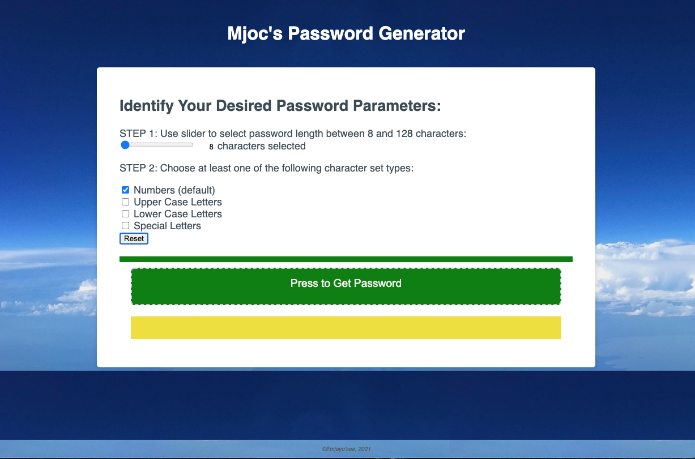
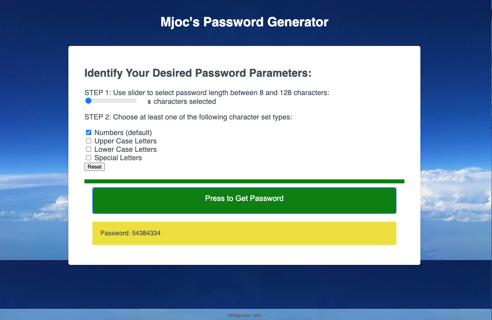
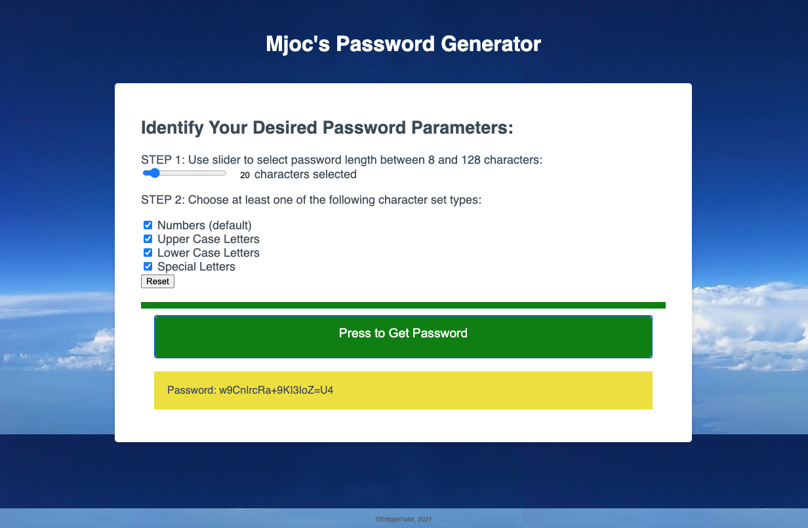

# Assignment03
This is the repo for the Password Generator assignment 3, due Jan 22, 2021.

# Unit 02 CSS and Bootstrap Homework: Responsive Portfolio Assignment

Portfolio: January 24, 2021, Michael O'Connor, WebDev Wannabe, 604 765-6061

# 01 Goal: The Goal of this project is to use the starter code and create a  password generator that will populate a password based on user defined criteria, for password length between 8 and 128 characters, using character sets that include either or all of numbers, uppercase, lowercase and special characters.  Here is a link to the Github folder https://github.com/Emjayosee/Assignment03 and a link to the deployed website https://emjayosee.github.io/Assignment03/.

# 02 Approach:

    In approching this project, I at first had no idea how to start and hoped that I woudl find inspiration in the video of the class on DOM.  I could follow how the variables could be defined, from a discussion in class activities. Fil allowed a dealy to submit until the weekend.  Panicked, I awoke at 1 am Froday morning, with the thought of googling the random math feature and then random string generators.  This led me to some code (that I later learned Fil had posted in resources on slack). I was able to tailor that code to generate the result.  When I got to class it would geneate an 8 digit letter and with some help from the TA, I saw how to write that to the document.  Then proceeded to work on creating a means of concatenating the various character sets, which I prefected by Saturday afternooon.  I then worked Sunday to add validation features, searching W3 to determine how to incorporate validation featiures that would be both intuitive for the user and ensure hat errors would minimized no matter what the user actions. 

    I have not used all of the client's starter text to format things, nor did I use the client's suggestion of a bunch of sequential dialogue boxes to set the criteria.   Rather I have used a slider to ensure that the user stays within the correct range and check boxes to select the character set types.  I have not used all of the special characters available since some are difficult to read or type or could result in odd outcomes when used in an actual; system, such a "/".   I have built in a reset button and as well the password resets if any of the variables are changed, this will ensure that the output is based on the visible input fields.   I thought about putting in a message if none of the dialog boxes were clicked, but heck, I can't cater to that level of incompetence (nor could I figure out exactly how to do that so I may take that up with my tutor).

    I chose to check only numbers as the default on initial rendering since I felt often sites will allow all numbers, and although it would generate a weaker password, I felt the user could click the remaining boxes if desried to minimize user involement (i.e. they do not need to unclick default boxes.)  I also set the slider value for the password length to display, and blocked users from overriding it to ensure that the range is maintained.

    I followed the following plan design:

        Password Generator Plan

            Goal:

            Press Button to Generate New Password

            Password Criteria Dialogue Box to select possible criteria:
            •	Length 8 to 128 Characters
            •	Upper Case
            •	Lower Case
            •	Numeric
            •	Special Characters

            Validation:
            •	Validate that there is a length specified between 8 and 128
            •	Validate that at least one of the check boxes is filled in

            Once validated generate password and display on the page.

# 03 Testing and Quality Control:

    1. I have tested each of the criteria to confirm functionality.

    2. HTML Code has been formatted to make it easier to follow when viewed at source.

    3. I have loaded the files and tested the page functionality at GITHUB.

    4. I had some issues with github as I moved the file between my desktop and laptop and will not do that again!

    5. I got more comfortable using the inspect feature of the Chrome dev tools to test various margins and padding around elements.

    6. I ran the html through a code validation service on the final commit.  I used validator.w3.org and the test identified that in the input tag, that "unchecked" was not an attribute, so I deleted, and still only checked numbers as the default.  I was able to adjust before the final commit.

# 04 Lessons Learned:

The following items should be considered for future enhancements, time and budget permitting:

    1. I learned how to incorporate Javascript to make an HTML file interface with the user.

    2. I got the basics of using if, and if else and how to bring that about.

    3. I see how a loop is involed, but need more work on that.

    4. I learned to pay more attention in class!

    5. I learned that this is addictive and striving for perfection must be resisted.

# 05 Further improvements to make:

    1. I could maybe display an alert if none of the fields are checked.  I obviated the need for that by using a slider.

    2. It can always be improved.

# 06 Current Renderings:

See Current Rendering at the time of writing in the Assignment01 Repo. 

